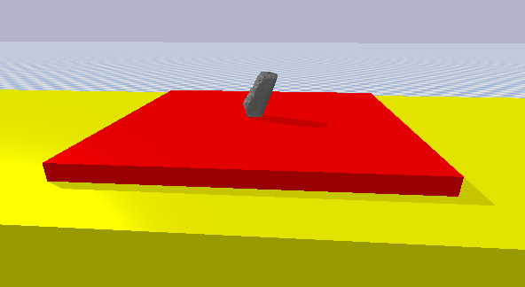

# virtual_shake_robot_pybullet
Virtual shake robot v2 based on PyBullet for earthquake studies

# Project  Overview:
The Virtual Shake Robot (VSR) V2.0 project is a simulation tool designed to study the dynamics of Precariously Balanced Rocks (PBRs) during overturning and large-displacement processes. Utilizing the PyBullet physics engine, the VSR offers an approach to study the effects of physics parameters on the dynamics of PBRs, which help us understand seismic hazards, rockfall prediction, and the fate of toppled PBRs with realistic material properties and terrains. This project is developed with the integration of robotics and machine learning technologies, aiming to automate rock mapping and analysis effectively.
# Simulation Software:

## PyBullet ##
We use PyBullet Python bindings for improved support for robotics, reinforcement learning and VR. Use pip install pybullet and checkout the [PyBullet Quickstart Guide](https://docs.google.com/document/d/10sXEhzFRSnvFcl3XxNGhnD4N2SedqwdAvK3dsihxVUA/edit#heading=h.2ye70wns7io3).


Cloning the Repository and Setting up the Workspace

To begin, clone the repository into your workspace. First, create a ROS2 workspace named ros2_ws if you don’t already have one:

```
mkdir -p ~/ros2_ws
cd ~/ros2_ws
git clone https://github.com/Akshay6077/virtual_shake_robot_pybullet.git
```
# Installatiion Guide
For the simulation to run on your system you need to have the ros2 humble version. So here is the installation guide for the ros2 humble in  the docs [ROS2_installation](docs/Ros_installation.md)

Before installing PyBullet, ensure you have the following prerequisites installed on your system:

- Python (3.6 or newer)
- pip (Python package installer)

## Steps ##

1 . Update pip
```
    pip install --upgrade pip
```
2 . Install PyBullet
```
    pip install pybullet
```
## Verifying the Installation ##
```
import pybullet as p
print(pb.__version__)

```
## Pybullet ROS2 Integration
 - Here we are using ROS2 since it has better dependenceies and the launch files in ROS2 provide more flexibility which can be very useful for the VSR 2.0

 For detailed info on the integration and the structure. Look [docs/VSR2_structure.md](docs/VSR2_structure.md)

 ## Building the Package 

 1 . Use the colcon package builder
 ```
 colcon build 

 ```
 2 . Source the package in the current directory

 ```
 source ~/install/setup.bash

 ```
 3 . Run the simulation_node.py for the pedestal mesh file using the launch file to launch the pybullet GUI for the VSR Structure.

 ```
 ros2 launch virtual_shake_robot_pybullet mesh_launch.py

 ```

 4 . For the box pedestal you need to launch the box_launch.py, which launches the control_node as well with it.

 ```
 ros2 launch virtual_shake_robot_pybullet box_launch.py

 ```
 ## Running the Control Node    

 The control node accepts amplitude (A) and frequency (F) values to simulate a single-pulse cosine motion of the pedestal. To trigger the motion, run:
 
 ```
 ros2 run virtual_shake_robot_pybullet pulse_motion_client.py 2.0 1.0
```

This command sends the A and F values to the control node, which generates the trajectory of the pedestal. The motion is calculated using the following equations:

 ```
   pulse motion
        displacement function: d = -A*cos(2*pi*F*t) + A
        velocity function: v = 2*pi*A*F*sin(2*pi*F*t)
        acceleration function: a = 4*pi^2*F^2*A*cos(2*pi*F*t)
```
This values are calucalted and send as an goal using an action message for the Trajectory in the [TrajectoryAction.action](action/TrajectoryAction.action)


Then in the simulation_node these values are used in the built-in API of the pybullet GUI setJointMotorControl2 

For further details about the calculation refer the tutorial [Inertia.md](docs/Inertia.md)

## Spawning PBR on top of the pedestal 

Now we have a good controller that can handle range of the A and F values, so we are ready for the spawning of the PBR, and carrying out the experiment.

```
ros2 run virtual_shake_robot_pybullet pbr_loader.py [box|mesh]
```

To spawn the PBR using a mesh file, you can utilize the command:

```
ros2 run virtual_shake_robot_pybullet pbr_loader.py mesh
```

Similarly for the box :

```
ros2 run virtual_shake_robot_pybullet pbr_loader.py box
```
For more details on calculating inertia for mesh files, refer to [Inertia.md](docs/Inertia.md). 




## Running the Experiment in Different Modes

There are four distinct experiment modes, which can be triggered by setting the motion_mode parameter.

Single Cosine Mode: This mode applies a single cosine motion based on provided A and F values and is the default mode.

The implementation for this experiment is given above in the README.md

Grid Cosine Mode : 

This mode generates a range of A and F values to simulate continuous experiments over a range of parameters.

```
ros2 launch virtual_shake_robot_pybullet box_launch.py motion_mode:=grid_cosine
```
Single Recording Mode:

This mode runs experiments based on real data collected in the lab. Each test is conducted on the SP1 or SP2 mesh models, and the result (whether the rock toppled) is verified.

You can specify a particular test number:

To trigger this :

```
ros2 launch virtual_shake_robot_pybullet sp1_launch.py motion_mode:=single_recording test_no:=11
```

After this you also need to launch the perception_node.py where we record the trajectory data.

```
ros2 run virtual_shake_robot_pybullet perception_node.py

```

All Recording Mode :

This mode runs all the recorded tests consecutively.

```
ros2 launch virtual_shake_robot_pybullet sp1_launch.py motion_mode:=all_recordings
```
Similarly launch the perception_node.py


## Parallel Simulation

The parallel simulation feature allows you to test different combinations of parameters simultaneously by leveraging multiple namespaces. This is particularly useful for running multiple instances of the experiment concurrently, reducing the time it takes to evaluate a wide range of physics parameters and their effects on PBR dynamics.

## Namespaced Simulations

By defining each simulation under its own namespace, we eliminate the need to generate separate YAML files for each experiment. This ensures that each simulation runs independently, even though the parameters and results are stored in shared directories. The use of ROS2 launch files enables seamless namespace management for multiple simulations.

To set up the parallel simulation:

1 .Generate YAML and Launch Files for Each Namespace:
 
 The script_generator.py automatically generates the required YAML files for each parameter combination and creates corresponding launch files under different namespaces.

```
ros2 run virtual_shake_robot_pybullet script_generator.py
```
This script will:

- Generate YAML files with combinations of physics parameters for each experiment.
- Create corresponding launch files for each generated YAML file.
- Additionally, create a master launch file (e.g., {mesh_file_name}_master_launch.py) that launches all simulations in parallel.`

2. Run the Master Launch File:

```
ros2 launch virtual_shake_robot_pybullet {mesh_file_name}_master_launch.py
```

3. Monitor the results

    Each simulation will log its results in separate files, organized by namespace. This allows you to later compare the behaviors of PBRs across different parameter combinations.


# Running Parallel Simulations on a Server (Manual Setup)

If you need to run the parallel simulations on a server with more computational power, you can manually set up the environment using a base ROS2 Docker image or build your own Dockerfile. Here's a step-by-step guide:

## 1. Using a Pre-Built ROS2 Docker Image

Start by pulling a base ROS2 Docker image that includes the ROS2 Humble release:
```bash
docker pull osrf/ros:humble-desktop
```
Manual Setup:

Once you have the image, you will need to install the following dependencies manually:

    pip (for Python package management)
    pybullet
    Any other dependencies required by your project.


start the docker container :

```
docker run -it --name vsr_ros2_simulation osrf/ros:humble-desktop
```

This will start the container with the dependencies.

So now follow the README.md for the vsr setup


Apptainer (formerly Singularity): Apptainer is more suited for shared server environments where you might not have root or sudo access, as it runs containers in a user space.

- Convert the docker image to an Apptainer Image

```
apptainer build vsr_simulation.sif docker://vsr_simulation

```
 - Run the container

```
apptainer run vsr_simulation.sif
```

Follow Similar steps as the docker container

# Memory Leakage Issue

Memory Leakage Issue

During the Virtual Shake Robot (VSR) simulations, a memory leakage issue was observed, especially in long-running or parallel experiments. The memory leakage was caused by several factors, including:

- Data Recording: Continuous data logging, where trajectory data was recorded over time, contributed to increased memory usage.
- Creating and Deleting Plots: The callback function included the creation and deletion of plots, which were not properly managed, leading to memory leaks.
- Loading and Deleting URDF Models: Repeated loading and deletion of URDF models contributed to memory fragmentation and memory leaks.

To mitigate these issues, changes were made to the simulation node to handle the data recording more efficiently, as well as moving the plotting function to a separate script (plotter.py) to avoid creating plots inside the callback function. Additionally, improvements were made in the management of URDF models to ensure they are loaded and deleted correctly.

## New Setup

To mitigate the memory leakage, we introduced a new setup where the perception node is no longer required for recording data. Instead, the recording process has been integrated directly into the simulation node. This change reduces memory overhead by avoiding the constant communication between nodes and streamlining the logging of trajectory data.

In the new setup, the trajectory is executed within the simulation node, and after each execution, the data is immediately saved to an .npy file. The memory used during the process is explicitly cleared to prevent any leakage.

## Original Setup Option

If you are not experiencing any memory leakage in your current setup, or if your experiments are running without memory issues, you can continue using the original setup. In this case, you can keep using the perception node for recording trajectory data as described in the README.md file.

For more technical details on how the new setup works and how to adjust your implementation, refer to the full report here.
[Memory_Issue_report](docs/Memory_Issue.md)


 