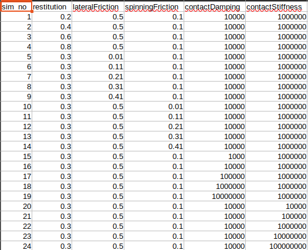
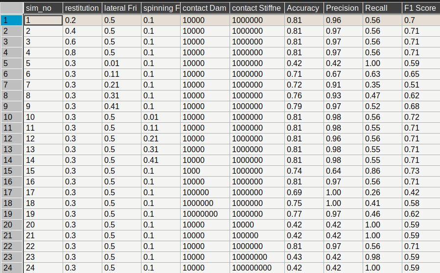
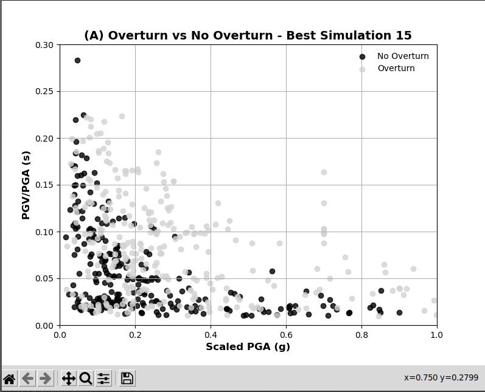

# Iterative Experiments on the PBR

We are conducting experiments using iterative parameter search to identify the optimal configuration for simulating the PBR. The table below illustrates the parameters used for each simulation:



In each simulation, we vary only one parameter to evaluate its influence on accuracy and its proximity to the ground truth data.

To visualize the ground truth data from the experiment, execute the following script:

```
python3 ground_truth_plot.py
```
Here's an improved and professional version of your README:
Iterative Experiments on the PBR

We are conducting experiments using iterative parameter search to identify the optimal configuration for simulating the PBR. The table below illustrates the parameters used for each simulation:

Parameter Table

In each simulation, we vary only one parameter to evaluate its influence on accuracy and its proximity to the ground truth data.

To visualize the ground truth data from the experiment, execute the following script:

python3 ground_truth_plot.py

This script generates the ground truth data along with the toppling analysis of the PBR. The experimental data is stored in the[Results_Experiment](virtual_shake_robot_pybullet/data/Results_Granite.xlsx)

## Experiment Analysis

For the analysis of the experiments we have the script [Rock_Analysis](virtual_shake_robot_pybullet/src/rock_analysis.py)

This script processes the .npy files recorded during the experiments and performs a toppling analysis based on the PBR's orientation. It also generates CSV files summarizing the toppling outcomes for each test.

Example:

    If the rock topples during a test, it is recorded as 1.
    If the rock remains balanced, it is recorded as 0

The resulting CSV files from the experiments are stored here:
[Experiment_Data](virtual_shake_robot_pybullet/data/simulation_1.csv)

## Metrics Calculation:

To calculate evaluation metrics such as accuracy, precision, recall, and F1-score, we use the official APIs from sklearn.metrics. These metrics allow us to compare the simulation results with the experimental ground truth data.

The metrics are automatically calculated by the rock_analysis.py script and saved as CSV files. Below is the table of the calculated metrics:

.

Additionally, the script identifies the parameter configuration with the highest evaluation score (e.g., F1-score) to determine the most accurate simulation. For example, the plot with the highest F1-score is shown below:

